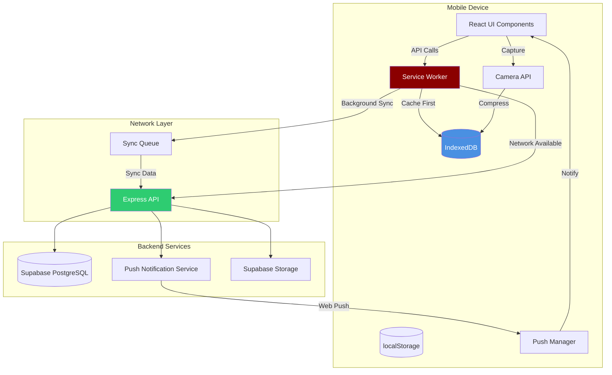
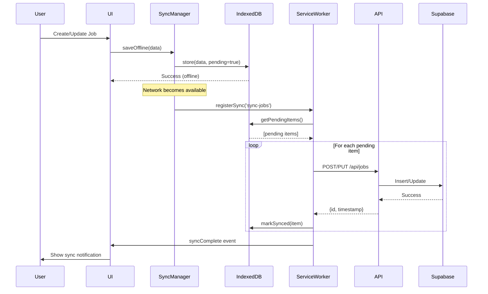
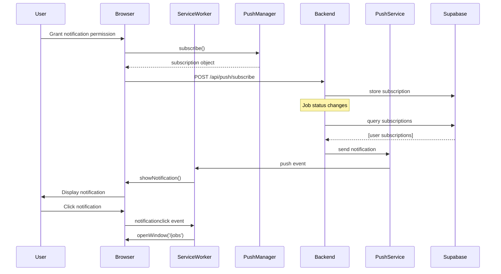
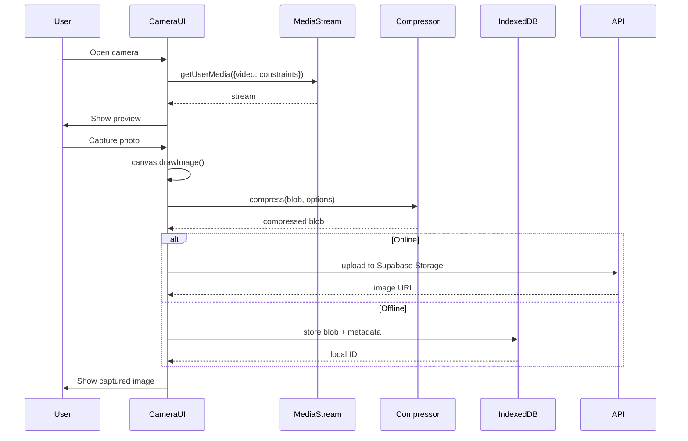

# Design Document: Mobile App Features for BenGift Clothing

## Overview

This design document outlines the implementation of three critical mobile app features for the BenGift Clothing tailor management system: offline mode with synchronization, push notifications for job updates, and camera optimization for measurement capture. The system currently operates as a Progressive Web App (PWA) with React + Vite frontend and Node.js + Express + Supabase backend. These enhancements will transform the app into a fully mobile-capable solution that works seamlessly in low-connectivity environments common in tailoring shops.

The design leverages existing PWA infrastructure (service workers, Workbox, manifest) and extends it with IndexedDB for offline storage, Web Push API for notifications, and MediaStream API for camera optimization. The solution maintains backward compatibility with the existing hybrid storage pattern (useHybridStorage hook) while adding robust offline-first capabilities.

## Architecture

### High-Level System Architecture



### Data Flow Diagrams

#### Offline Mode Data Flow



#### Push Notification Flow



#### Camera Optimization Flow



## Components and Interfaces

### Feature 1: Offline Mode with Sync

#### Component 1.1: SyncManager

**Purpose**: Manages offline data storage, conflict resolution, and background synchronization

**Interface**:
```javascript
class SyncManager {
  // Initialize sync manager with database
  constructor(dbName, version)
  
  // Store data offline with pending sync flag
  async saveOffline(storeName, data, operation)
  
  // Get all pending sync items
  async getPendingSync(storeName)
  
  // Mark item as synced
  async markSynced(storeName, id, serverData)
  
  // Register background sync
  async registerBackgroundSync(tag)
  
  // Sync all pending items
  async syncAll()
  
  // Handle sync conflicts
  async resolveConflict(localData, serverData, strategy)
  
  // Check online status
  isOnline()
  
  // Listen to online/offline events
  onConnectionChange(callback)
}
```

**Responsibilities**:
- Maintain IndexedDB connection for offline storage
- Queue operations when offline (CREATE, UPDATE, DELETE)
- Detect network connectivity changes
- Trigger background sync when online
- Resolve conflicts using last-write-wins or custom strategies
- Emit events for sync status updates

#### Component 1.2: IndexedDB Schema

**Purpose**: Define database structure for offline storage

**Schema Definition**:
```javascript
const DB_NAME = 'bengift_offline'
const DB_VERSION = 1

const STORES = {
  jobs: {
    keyPath: 'id',
    indexes: [
      { name: 'syncStatus', keyPath: 'syncStatus', unique: false },
      { name: 'timestamp', keyPath: 'timestamp', unique: false },
      { name: 'jobNo', keyPath: 'jobNo', unique: false }
    ]
  },
  customers: {
    keyPath: 'id',
    indexes: [
      { name: 'syncStatus', keyPath: 'syncStatus', unique: false },
      { name: 'phone', keyPath: 'phone', unique: false }
    ]
  },
  workers: {
    keyPath: 'id',
    indexes: [
      { name: 'syncStatus', keyPath: 'syncStatus', unique: false }
    ]
  },
  fabrics: {
    keyPath: 'id',
    indexes: [
      { name: 'syncStatus', keyPath: 'syncStatus', unique: false }
    ]
  },
  images: {
    keyPath: 'id',
    indexes: [
      { name: 'syncStatus', keyPath: 'syncStatus', unique: false },
      { name: 'jobId', keyPath: 'jobId', unique: false }
    ]
  },
  syncQueue: {
    keyPath: 'id',
    autoIncrement: true,
    indexes: [
      { name: 'status', keyPath: 'status', unique: false },
      { name: 'timestamp', keyPath: 'timestamp', unique: false }
    ]
  }
}
```

**Data Models**:
```javascript
// Sync Queue Item
interface SyncQueueItem {
  id?: number              // Auto-increment
  storeName: string        // 'jobs' | 'customers' | 'workers' | 'fabrics'
  operation: string        // 'CREATE' | 'UPDATE' | 'DELETE'
  data: any               // The actual data to sync
  localId: string         // Local temporary ID
  serverId?: string       // Server ID after sync
  status: string          // 'pending' | 'syncing' | 'synced' | 'failed'
  timestamp: number       // Creation timestamp
  retryCount: number      // Number of retry attempts
  error?: string          // Error message if failed
}

// Offline Job (extends existing Job model)
interface OfflineJob {
  id: string
  jobNo: string
  customerName: string
  customerId?: string
  orderDate: string
  deliveryDate: string
  trialDate?: string
  workerId?: string
  items: Array<JobItem>
  totalAmount: number
  advancePaid: number
  balance: number
  receiptAccount: string
  status: string
  notes?: string
  
  // Offline-specific fields
  syncStatus: 'pending' | 'synced' | 'conflict'
  localTimestamp: number
  serverTimestamp?: number
  isLocalOnly: boolean
}
```

#### Component 1.3: useOfflineSync Hook

**Purpose**: React hook for offline-first data operations

**Interface**:
```javascript
function useOfflineSync(storeName, apiEndpoint) {
  // State
  const [data, setData] = useState([])
  const [loading, setLoading] = useState(true)
  const [syncing, setSyncing] = useState(false)
  const [pendingCount, setPendingCount] = useState(0)
  const [isOnline, setIsOnline] = useState(navigator.onLine)
  
  // Methods
  const create = async (item) => Promise<any>
  const update = async (id, item) => Promise<any>
  const remove = async (id) => Promise<void>
  const getAll = async () => Promise<any[]>
  const getById = async (id) => Promise<any>
  const syncNow = async () => Promise<void>
  
  return {
    data,
    loading,
    syncing,
    pendingCount,
    isOnline,
    create,
    update,
    remove,
    getAll,
    getById,
    syncNow
  }
}
```

**Responsibilities**:
- Provide React-friendly interface for offline operations
- Automatically sync when online
- Track pending sync count
- Emit loading and syncing states
- Handle optimistic UI updates

### Feature 2: Push Notifications

#### Component 2.1: PushNotificationManager

**Purpose**: Manage push notification subscriptions and display

**Interface**:
```javascript
class PushNotificationManager {
  // Request notification permission
  async requestPermission()
  
  // Subscribe to push notifications
  async subscribe()
  
  // Unsubscribe from push notifications
  async unsubscribe()
  
  // Get current subscription
  async getSubscription()
  
  // Check if notifications are supported
  isSupported()
  
  // Check if permission is granted
  isPermissionGranted()
  
  // Send subscription to server
  async sendSubscriptionToServer(subscription)
  
  // Show local notification
  async showNotification(title, options)
}
```

**Responsibilities**:
- Request and manage notification permissions
- Create and manage push subscriptions
- Send subscription data to backend
- Display notifications with custom actions
- Handle notification clicks and actions

#### Component 2.2: Notification Types

**Purpose**: Define notification schemas for different events

**Notification Schemas**:
```javascript
// Job Status Update Notification
interface JobStatusNotification {
  type: 'job_status_update'
  title: string
  body: string
  data: {
    jobId: string
    jobNo: string
    oldStatus: string
    newStatus: string
    customerName: string
  }
  actions: [
    { action: 'view', title: 'View Job' },
    { action: 'close', title: 'Dismiss' }
  ]
  icon: '/images/LOGO WINE.png'
  badge: '/images/LOGO WINE.png'
  tag: 'job-status'
  requireInteraction: false
}

// Trial Reminder Notification
interface TrialReminderNotification {
  type: 'trial_reminder'
  title: string
  body: string
  data: {
    jobId: string
    jobNo: string
    customerName: string
    trialDate: string
    customerPhone?: string
  }
  actions: [
    { action: 'view', title: 'View Job' },
    { action: 'call', title: 'Call Customer' },
    { action: 'close', title: 'Dismiss' }
  ]
  icon: '/images/LOGO WINE.png'
  badge: '/images/LOGO WINE.png'
  tag: 'trial-reminder'
  requireInteraction: true
}

// Delivery Alert Notification
interface DeliveryAlertNotification {
  type: 'delivery_alert'
  title: string
  body: string
  data: {
    jobId: string
    jobNo: string
    customerName: string
    deliveryDate: string
    balance: number
  }
  actions: [
    { action: 'view', title: 'View Job' },
    { action: 'mark_delivered', title: 'Mark Delivered' },
    { action: 'close', title: 'Dismiss' }
  ]
  icon: '/images/LOGO WINE.png'
  badge: '/images/LOGO WINE.png'
  tag: 'delivery-alert'
  requireInteraction: true
}
```

#### Component 2.3: Backend Push Service

**Purpose**: Server-side push notification management

**Interface**:
```javascript
class PushService {
  // Store push subscription
  async saveSubscription(userId, subscription)
  
  // Remove subscription
  async removeSubscription(userId, endpoint)
  
  // Get user subscriptions
  async getUserSubscriptions(userId)
  
  // Send notification to user
  async sendToUser(userId, notification)
  
  // Send notification to multiple users
  async sendToUsers(userIds, notification)
  
  // Send notification to all users
  async sendToAll(notification)
  
  // Schedule notification
  async scheduleNotification(userId, notification, sendAt)
  
  // Cancel scheduled notification
  async cancelScheduledNotification(notificationId)
}
```

**Responsibilities**:
- Store and manage push subscriptions in Supabase
- Send push notifications using Web Push protocol
- Schedule notifications for trials and deliveries
- Handle notification delivery failures
- Track notification analytics

### Feature 3: Camera Optimization

#### Component 3.1: CameraCapture Component

**Purpose**: Optimized camera interface for measurement photos

**Interface**:
```javascript
interface CameraCapture {
  // Props
  onCapture: (blob: Blob, metadata: ImageMetadata) => void
  onError: (error: Error) => void
  maxWidth?: number
  maxHeight?: number
  quality?: number
  facingMode?: 'user' | 'environment'
  aspectRatio?: number
  
  // State
  isActive: boolean
  isCapturing: boolean
  stream: MediaStream | null
  error: string | null
  
  // Methods
  startCamera: () => Promise<void>
  stopCamera: () => void
  capturePhoto: () => Promise<void>
  switchCamera: () => Promise<void>
  setZoom: (level: number) => void
  toggleFlash: () => void
}

interface ImageMetadata {
  width: number
  height: number
  size: number
  format: string
  timestamp: number
  compressed: boolean
  originalSize?: number
}
```

**Responsibilities**:
- Access device camera with optimal constraints
- Display live camera preview
- Capture high-quality photos
- Support front/back camera switching
- Handle camera permissions
- Provide zoom and flash controls

#### Component 3.2: ImageCompressor

**Purpose**: Compress images for efficient storage and upload

**Interface**:
```javascript
class ImageCompressor {
  // Compress image blob
  async compress(blob, options)
  
  // Compress with progressive quality
  async compressToTarget(blob, targetSizeKB)
  
  // Resize image
  async resize(blob, maxWidth, maxHeight)
  
  // Convert format
  async convertFormat(blob, format)
  
  // Get image dimensions
  async getDimensions(blob)
  
  // Create thumbnail
  async createThumbnail(blob, size)
}

interface CompressionOptions {
  maxWidth: number          // Default: 1920
  maxHeight: number         // Default: 1080
  quality: number           // 0-1, Default: 0.8
  format: string           // 'image/jpeg' | 'image/webp'
  preserveExif: boolean    // Default: false
}
```

**Responsibilities**:
- Compress images to reduce file size
- Maintain acceptable image quality
- Support multiple image formats
- Generate thumbnails for previews
- Preserve aspect ratios

#### Component 3.3: ImageStorageManager

**Purpose**: Manage image storage (offline and online)

**Interface**:
```javascript
class ImageStorageManager {
  // Store image locally (IndexedDB)
  async storeLocal(blob, metadata)
  
  // Upload image to Supabase Storage
  async uploadToCloud(blob, path)
  
  // Get image from local storage
  async getLocal(id)
  
  // Get image URL from cloud
  async getCloudUrl(path)
  
  // Sync local images to cloud
  async syncImages()
  
  // Delete local image
  async deleteLocal(id)
  
  // Delete cloud image
  async deleteCloud(path)
  
  // Get storage usage
  async getStorageUsage()
  
  // Clear old cached images
  async clearCache(olderThanDays)
}
```

**Responsibilities**:
- Store images in IndexedDB when offline
- Upload images to Supabase Storage when online
- Manage image cache and cleanup
- Track storage quota usage
- Sync pending images in background

## Algorithmic Pseudocode

### Algorithm 1: Offline Data Synchronization

```javascript
/**
 * Synchronizes pending offline operations with the server
 * Handles conflicts using last-write-wins strategy
 */
async function syncPendingOperations() {
  // Preconditions:
  // - navigator.onLine === true
  // - IndexedDB is initialized and accessible
  // - API endpoint is reachable
  
  const pendingItems = await syncQueue.getAll({ status: 'pending' })
  const results = { success: [], failed: [] }
  
  // Loop invariant: All processed items are either synced or marked as failed
  for (const item of pendingItems) {
    try {
      // Mark as syncing to prevent duplicate sync attempts
      await syncQueue.update(item.id, { status: 'syncing' })
      
      let response
      
      // Execute operation based on type
      switch (item.operation) {
        case 'CREATE':
          response = await api.post(`/api/${item.storeName}`, item.data)
          break
        
        case 'UPDATE':
          response = await api.put(`/api/${item.storeName}/${item.serverId || item.localId}`, item.data)
          break
        
        case 'DELETE':
          response = await api.delete(`/api/${item.storeName}/${item.serverId || item.localId}`)
          break
      }
      
      // Update local store with server data
      if (item.operation !== 'DELETE') {
        await db.put(item.storeName, {
          ...response.data,
          syncStatus: 'synced',
          serverTimestamp: Date.now()
        })
      } else {
        await db.delete(item.storeName, item.localId)
      }
      
      // Mark sync item as completed
      await syncQueue.update(item.id, { 
        status: 'synced',
        serverId: response.data?.id,
        syncedAt: Date.now()
      })
      
      results.success.push(item)
      
    } catch (error) {
      // Handle sync failure
      const retryCount = item.retryCount + 1
      
      if (retryCount >= MAX_RETRY_ATTEMPTS) {
        // Max retries reached, mark as failed
        await syncQueue.update(item.id, {
          status: 'failed',
          error: error.message,
          retryCount
        })
        results.failed.push({ item, error })
      } else {
        // Reset to pending for retry
        await syncQueue.update(item.id, {
          status: 'pending',
          retryCount
        })
      }
    }
  }
  
  // Postconditions:
  // - All pending items have been processed
  // - Successful syncs are marked as 'synced'
  // - Failed syncs are marked as 'failed' or 'pending' for retry
  // - Local data matches server data for synced items
  
  return results
}
```

### Algorithm 2: Conflict Resolution

```javascript
/**
 * Resolves conflicts between local and server data
 * Uses last-write-wins strategy with optional manual resolution
 */
async function resolveConflict(localData, serverData, strategy = 'last-write-wins') {
  // Preconditions:
  // - localData and serverData are valid objects
  // - Both have timestamp fields
  // - strategy is one of: 'last-write-wins', 'server-wins', 'local-wins', 'manual'
  
  let resolvedData
  
  switch (strategy) {
    case 'last-write-wins':
      // Compare timestamps
      if (localData.localTimestamp > serverData.serverTimestamp) {
        resolvedData = localData
        // Push local changes to server
        await api.put(`/api/${storeName}/${serverData.id}`, localData)
      } else {
        resolvedData = serverData
        // Update local with server data
        await db.put(storeName, serverData)
      }
      break
    
    case 'server-wins':
      resolvedData = serverData
      await db.put(storeName, serverData)
      break
    
    case 'local-wins':
      resolvedData = localData
      await api.put(`/api/${storeName}/${serverData.id}`, localData)
      break
    
    case 'manual':
      // Show conflict resolution UI to user
      resolvedData = await showConflictResolutionUI(localData, serverData)
      
      // Apply user's choice
      await db.put(storeName, resolvedData)
      await api.put(`/api/${storeName}/${serverData.id}`, resolvedData)
      break
  }
  
  // Mark as resolved
  await db.put(storeName, {
    ...resolvedData,
    syncStatus: 'synced',
    conflictResolved: true,
    resolvedAt: Date.now()
  })
  
  // Postconditions:
  // - Conflict is resolved according to strategy
  // - Both local and server data are consistent
  // - Item is marked as synced
  
  return resolvedData
}
```

### Algorithm 3: Image Compression with Quality Target

```javascript
/**
 * Compresses image to target file size while maintaining quality
 * Uses binary search approach for optimal quality setting
 */
async function compressToTargetSize(blob, targetSizeKB, tolerance = 0.1) {
  // Preconditions:
  // - blob is a valid image Blob
  // - targetSizeKB > 0
  // - tolerance is between 0 and 1
  
  const targetBytes = targetSizeKB * 1024
  const toleranceBytes = targetBytes * tolerance
  
  let minQuality = 0.1
  let maxQuality = 1.0
  let bestBlob = blob
  let iterations = 0
  const MAX_ITERATIONS = 10
  
  // Binary search for optimal quality
  // Loop invariant: bestBlob size is closest to target within current search range
  while (iterations < MAX_ITERATIONS && (maxQuality - minQuality) > 0.05) {
    const quality = (minQuality + maxQuality) / 2
    
    // Compress with current quality
    const compressed = await compressImage(blob, {
      quality,
      maxWidth: 1920,
      maxHeight: 1080,
      format: 'image/jpeg'
    })
    
    const compressedSize = compressed.size
    
    // Check if within tolerance
    if (Math.abs(compressedSize - targetBytes) <= toleranceBytes) {
      bestBlob = compressed
      break
    }
    
    // Adjust search range
    if (compressedSize > targetBytes) {
      // File too large, reduce quality
      maxQuality = quality
    } else {
      // File too small, increase quality
      minQuality = quality
      bestBlob = compressed // Keep this as best so far
    }
    
    iterations++
  }
  
  // If still too large after max iterations, use aggressive compression
  if (bestBlob.size > targetBytes + toleranceBytes) {
    bestBlob = await compressImage(blob, {
      quality: 0.6,
      maxWidth: 1280,
      maxHeight: 720,
      format: 'image/jpeg'
    })
  }
  
  // Postconditions:
  // - bestBlob.size is within tolerance of targetBytes, or as close as possible
  // - Image quality is maximized within size constraint
  // - Original blob is unchanged
  
  return {
    blob: bestBlob,
    originalSize: blob.size,
    compressedSize: bestBlob.size,
    compressionRatio: (1 - bestBlob.size / blob.size) * 100,
    iterations
  }
}
```

### Algorithm 4: Background Sync Registration

```javascript
/**
 * Registers background sync for offline operations
 * Ensures sync happens when network is available
 */
async function registerBackgroundSync(tag = 'sync-data') {
  // Preconditions:
  // - Service worker is registered and active
  // - Background Sync API is supported
  // - There are pending sync items in queue
  
  try {
    // Check if Background Sync is supported
    if (!('sync' in self.registration)) {
      console.warn('Background Sync not supported, falling back to immediate sync')
      // Fallback: attempt immediate sync if online
      if (navigator.onLine) {
        await syncPendingOperations()
      }
      return false
    }
    
    // Register sync event
    await self.registration.sync.register(tag)
    
    console.log(`Background sync registered: ${tag}`)
    
    // Store registration metadata
    await db.put('syncMetadata', {
      tag,
      registeredAt: Date.now(),
      status: 'registered'
    })
    
    return true
    
  } catch (error) {
    console.error('Failed to register background sync:', error)
    
    // Fallback: schedule periodic sync check
    schedulePeriodicSyncCheck()
    
    return false
  }
  
  // Postconditions:
  // - Background sync is registered with service worker
  // - Sync will trigger when network is available
  // - Fallback mechanism is in place if sync fails
}

/**
 * Service Worker: Handle sync event
 */
self.addEventListener('sync', async (event) => {
  // Preconditions:
  // - Sync event is triggered by browser
  // - Network is available
  
  if (event.tag === 'sync-data') {
    event.waitUntil(
      (async () => {
        try {
          // Perform sync
          const results = await syncPendingOperations()
          
          // Notify clients of sync completion
          const clients = await self.clients.matchAll()
          clients.forEach(client => {
            client.postMessage({
              type: 'SYNC_COMPLETE',
              results
            })
          })
          
          // Update sync metadata
          await db.put('syncMetadata', {
            tag: event.tag,
            lastSyncAt: Date.now(),
            status: 'completed',
            results
          })
          
        } catch (error) {
          console.error('Sync failed:', error)
          
          // Update sync metadata with error
          await db.put('syncMetadata', {
            tag: event.tag,
            lastSyncAt: Date.now(),
            status: 'failed',
            error: error.message
          })
          
          // Re-register sync for retry
          await self.registration.sync.register(event.tag)
        }
      })()
    )
  }
  
  // Postconditions:
  // - All pending operations are synced or marked for retry
  // - Clients are notified of sync status
  // - Sync metadata is updated
})
```

### Algorithm 5: Push Notification Scheduling

```javascript
/**
 * Schedules push notifications for trials and deliveries
 * Runs as a cron job on the backend
 */
async function scheduleNotifications() {
  // Preconditions:
  // - Database connection is active
  // - Push service is configured
  // - VAPID keys are set
  
  const now = new Date()
  const tomorrow = new Date(now)
  tomorrow.setDate(tomorrow.getDate() + 1)
  
  // Get jobs with trials tomorrow
  const trialJobs = await Job.findAll({
    trialDate: tomorrow.toISOString().split('T')[0],
    status: ['Pending', 'In Progress']
  })
  
  // Get jobs with deliveries tomorrow
  const deliveryJobs = await Job.findAll({
    deliveryDate: tomorrow.toISOString().split('T')[0],
    status: ['Ready']
  })
  
  // Get all active push subscriptions
  const subscriptions = await PushSubscription.findAll({ active: true })
  
  // Loop invariant: All jobs are processed and notifications are sent
  for (const job of trialJobs) {
    const notification = {
      type: 'trial_reminder',
      title: `Trial Reminder: ${job.customerName}`,
      body: `Trial scheduled for Job #${job.jobNo} tomorrow`,
      data: {
        jobId: job.id,
        jobNo: job.jobNo,
        customerName: job.customerName,
        trialDate: job.trialDate
      },
      actions: [
        { action: 'view', title: 'View Job' },
        { action: 'call', title: 'Call Customer' }
      ]
    }
    
    // Send to all subscribed users
    for (const subscription of subscriptions) {
      try {
        await pushService.send(subscription, notification)
        
        // Log notification
        await NotificationLog.create({
          subscriptionId: subscription.id,
          jobId: job.id,
          type: 'trial_reminder',
          sentAt: Date.now(),
          status: 'sent'
        })
      } catch (error) {
        console.error(`Failed to send notification to ${subscription.id}:`, error)
        
        // Log failure
        await NotificationLog.create({
          subscriptionId: subscription.id,
          jobId: job.id,
          type: 'trial_reminder',
          sentAt: Date.now(),
          status: 'failed',
          error: error.message
        })
      }
    }
  }
  
  // Similar loop for delivery notifications
  for (const job of deliveryJobs) {
    const notification = {
      type: 'delivery_alert',
      title: `Delivery Due: ${job.customerName}`,
      body: `Job #${job.jobNo} ready for delivery tomorrow. Balance: GH₵${job.balance}`,
      data: {
        jobId: job.id,
        jobNo: job.jobNo,
        customerName: job.customerName,
        deliveryDate: job.deliveryDate,
        balance: job.balance
      },
      actions: [
        { action: 'view', title: 'View Job' },
        { action: 'mark_delivered', title: 'Mark Delivered' }
      ]
    }
    
    for (const subscription of subscriptions) {
      try {
        await pushService.send(subscription, notification)
        await NotificationLog.create({
          subscriptionId: subscription.id,
          jobId: job.id,
          type: 'delivery_alert',
          sentAt: Date.now(),
          status: 'sent'
        })
      } catch (error) {
        console.error(`Failed to send notification:`, error)
        await NotificationLog.create({
          subscriptionId: subscription.id,
          jobId: job.id,
          type: 'delivery_alert',
          sentAt: Date.now(),
          status: 'failed',
          error: error.message
        })
      }
    }
  }
  
  // Postconditions:
  // - All eligible jobs have notifications sent
  // - All notification attempts are logged
  // - Failed notifications are recorded for retry
  
  return {
    trialNotifications: trialJobs.length * subscriptions.length,
    deliveryNotifications: deliveryJobs.length * subscriptions.length
  }
}
```

## Key Functions with Formal Specifications

### Function 1: initializeIndexedDB()

```javascript
async function initializeIndexedDB(dbName, version, stores)
```

**Preconditions:**
- `dbName` is a non-empty string
- `version` is a positive integer
- `stores` is a valid object defining store schemas
- IndexedDB is supported in the browser

**Postconditions:**
- Returns an open IDBDatabase connection
- All specified object stores are created
- All indexes are created for each store
- Database is ready for read/write operations
- If database already exists at version, returns existing connection

**Loop Invariants:** 
- For store creation loop: All previously created stores are accessible and properly indexed

### Function 2: queueOfflineOperation()

```javascript
async function queueOfflineOperation(storeName, operation, data)
```

**Preconditions:**
- `storeName` is one of: 'jobs', 'customers', 'workers', 'fabrics', 'images'
- `operation` is one of: 'CREATE', 'UPDATE', 'DELETE'
- `data` is a valid object for the specified store
- IndexedDB connection is open

**Postconditions:**
- Operation is added to syncQueue with status 'pending'
- Data is stored in local store with syncStatus 'pending'
- Returns queue item ID
- If offline, background sync is registered
- If online, immediate sync is attempted

**Loop Invariants:** N/A (no loops)

### Function 3: subscribeToPush()

```javascript
async function subscribeToPush(serviceWorkerRegistration)
```

**Preconditions:**
- Service worker is registered and active
- Notification permission is granted
- VAPID public key is available
- Push API is supported

**Postconditions:**
- Returns PushSubscription object
- Subscription is sent to backend and stored
- User can receive push notifications
- If subscription fails, returns null and logs error

**Loop Invariants:** N/A (no loops)

### Function 4: captureAndCompressImage()

```javascript
async function captureAndCompressImage(videoElement, options)
```

**Preconditions:**
- `videoElement` has an active MediaStream
- `options.maxWidth` and `options.maxHeight` are positive integers
- `options.quality` is between 0 and 1
- Canvas API is available

**Postconditions:**
- Returns compressed image Blob
- Image dimensions are ≤ maxWidth and maxHeight
- Aspect ratio is preserved
- File size is reduced by compression
- Original video stream is unchanged

**Loop Invariants:** N/A (no loops)

### Function 5: syncImageToCloud()

```javascript
async function syncImageToCloud(localImageId)
```

**Preconditions:**
- `localImageId` exists in IndexedDB images store
- Network connection is available
- Supabase Storage is accessible
- User has upload permissions

**Postconditions:**
- Image is uploaded to Supabase Storage
- Returns cloud storage URL
- Local image is marked as synced
- Local image metadata includes cloud URL
- If upload fails, image remains in local store with pending status

**Loop Invariants:** N/A (no loops)

## Example Usage

### Example 1: Creating a Job Offline

```javascript
import { useOfflineSync } from './hooks/useOfflineSync'

function NewJobCard() {
  const { create, syncing, pendingCount, isOnline } = useOfflineSync('jobs', '/api/jobs')
  
  const handleSubmit = async (formData) => {
    try {
      // Create job (works offline or online)
      const job = await create({
        jobNo: formData.jobNo,
        customerName: formData.customerName,
        orderDate: new Date().toISOString(),
        deliveryDate: formData.deliveryDate,
        items: formData.items,
        totalAmount: formData.totalAmount,
        advancePaid: formData.advancePaid,
        balance: formData.balance,
        status: 'Pending'
      })
      
      toast.success(
        isOnline 
          ? 'Job created successfully' 
          : 'Job saved offline. Will sync when online.'
      )
      
      return job
    } catch (error) {
      toast.error('Failed to create job')
      console.error(error)
    }
  }
  
  return (
    <div>
      {!isOnline && (
        <div className="offline-banner">
          📡 Offline Mode - {pendingCount} items pending sync
        </div>
      )}
      
      {syncing && (
        <div className="sync-indicator">
          🔄 Syncing data...
        </div>
      )}
      
      <form onSubmit={handleSubmit}>
        {/* Form fields */}
      </form>
    </div>
  )
}
```

### Example 2: Subscribing to Push Notifications

```javascript
import { PushNotificationManager } from './services/pushNotifications'

function Settings() {
  const [notificationsEnabled, setNotificationsEnabled] = useState(false)
  const pushManager = new PushNotificationManager()
  
  useEffect(() => {
    // Check current subscription status
    const checkSubscription = async () => {
      const subscription = await pushManager.getSubscription()
      setNotificationsEnabled(!!subscription)
    }
    checkSubscription()
  }, [])
  
  const handleToggleNotifications = async () => {
    try {
      if (notificationsEnabled) {
        // Unsubscribe
        await pushManager.unsubscribe()
        setNotificationsEnabled(false)
        toast.success('Notifications disabled')
      } else {
        // Request permission and subscribe
        const permission = await pushManager.requestPermission()
        
        if (permission === 'granted') {
          await pushManager.subscribe()
          setNotificationsEnabled(true)
          toast.success('Notifications enabled')
        } else {
          toast.error('Notification permission denied')
        }
      }
    } catch (error) {
      toast.error('Failed to update notification settings')
      console.error(error)
    }
  }
  
  return (
    <div className="settings">
      <h2>Notification Settings</h2>
      
      <div className="setting-item">
        <label>
          <input
            type="checkbox"
            checked={notificationsEnabled}
            onChange={handleToggleNotifications}
          />
          Enable push notifications
        </label>
        <p className="setting-description">
          Receive notifications for job updates, trial reminders, and delivery alerts
        </p>
      </div>
      
      {notificationsEnabled && (
        <div className="notification-types">
          <h3>Notification Types</h3>
          <ul>
            <li>✅ Job status updates</li>
            <li>✅ Trial reminders (1 day before)</li>
            <li>✅ Delivery alerts (1 day before)</li>
          </ul>
        </div>
      )}
    </div>
  )
}
```

### Example 3: Capturing and Compressing Measurement Photos

```javascript
import { CameraCapture } from './components/CameraCapture'
import { ImageCompressor } from './services/imageCompressor'
import { ImageStorageManager } from './services/imageStorage'

function MeasurementCapture({ jobId, onImageCaptured }) {
  const [cameraActive, setCameraActive] = useState(false)
  const compressor = new ImageCompressor()
  const storage = new ImageStorageManager()
  
  const handleCapture = async (blob, metadata) => {
    try {
      // Compress image to target size (500KB)
      const compressed = await compressor.compressToTarget(blob, 500)
      
      console.log(`Compressed: ${compressed.originalSize}B → ${compressed.compressedSize}B`)
      console.log(`Compression ratio: ${compressed.compressionRatio.toFixed(1)}%`)
      
      // Store image (offline or online)
      let imageUrl
      if (navigator.onLine) {
        // Upload to Supabase Storage
        imageUrl = await storage.uploadToCloud(
          compressed.blob,
          `measurements/${jobId}/${Date.now()}.jpg`
        )
      } else {
        // Store locally in IndexedDB
        const localId = await storage.storeLocal(compressed.blob, {
          jobId,
          type: 'measurement',
          timestamp: Date.now(),
          syncStatus: 'pending'
        })
        imageUrl = `local://${localId}`
      }
      
      // Notify parent component
      onImageCaptured({
        url: imageUrl,
        size: compressed.compressedSize,
        dimensions: {
          width: metadata.width,
          height: metadata.height
        }
      })
      
      toast.success('Photo captured successfully')
      setCameraActive(false)
      
    } catch (error) {
      toast.error('Failed to process image')
      console.error(error)
    }
  }
  
  return (
    <div className="measurement-capture">
      {!cameraActive ? (
        <button onClick={() => setCameraActive(true)}>
          📷 Capture Measurement Photo
        </button>
      ) : (
        <CameraCapture
          onCapture={handleCapture}
          onError={(error) => {
            toast.error('Camera error: ' + error.message)
            setCameraActive(false)
          }}
          maxWidth={1920}
          maxHeight={1080}
          quality={0.85}
          facingMode="environment"
        />
      )}
    </div>
  )
}
```

### Example 4: Service Worker Push Event Handler

```javascript
// sw.js - Service Worker

self.addEventListener('push', (event) => {
  if (!event.data) return
  
  const data = event.data.json()
  
  const options = {
    body: data.body,
    icon: data.icon || '/images/LOGO WINE.png',
    badge: data.badge || '/images/LOGO WINE.png',
    data: data.data,
    actions: data.actions || [],
    tag: data.tag,
    requireInteraction: data.requireInteraction || false,
    vibrate: [200, 100, 200]
  }
  
  event.waitUntil(
    self.registration.showNotification(data.title, options)
  )
})

self.addEventListener('notificationclick', (event) => {
  event.notification.close()
  
  const action = event.action
  const data = event.notification.data
  
  event.waitUntil(
    (async () => {
      const clients = await self.clients.matchAll({ type: 'window' })
      
      // Handle different actions
      if (action === 'view') {
        const url = `/jobs?id=${data.jobId}`
        
        // Focus existing window or open new one
        for (const client of clients) {
          if (client.url.includes('/jobs') && 'focus' in client) {
            await client.focus()
            client.postMessage({ type: 'NAVIGATE', url })
            return
          }
        }
        
        if (clients.openWindow) {
          await clients.openWindow(url)
        }
      } else if (action === 'call' && data.customerPhone) {
        // Open phone dialer
        await clients.openWindow(`tel:${data.customerPhone}`)
      } else if (action === 'mark_delivered') {
        // Update job status via API
        await fetch(`/api/jobs/${data.jobId}/status`, {
          method: 'PATCH',
          headers: { 'Content-Type': 'application/json' },
          body: JSON.stringify({ status: 'Delivered' })
        })
        
        // Show confirmation notification
        await self.registration.showNotification('Job Updated', {
          body: `Job #${data.jobNo} marked as delivered`,
          icon: '/images/LOGO WINE.png'
        })
      }
    })()
  )
})
```

## Correctness Properties

### Property 1: Data Consistency (Offline Sync)

**Universal Quantification:**
```
∀ item ∈ syncQueue:
  (item.status = 'synced') ⟹ 
    (localData[item.localId] = serverData[item.serverId]) ∧
    (item.syncedAt ≥ item.timestamp)
```

**Meaning:** For all items in the sync queue, if an item is marked as synced, then the local data must match the server data, and the sync timestamp must be after or equal to the creation timestamp.

### Property 2: No Data Loss (Offline Operations)

**Universal Quantification:**
```
∀ operation ∈ {CREATE, UPDATE, DELETE}:
  (navigator.onLine = false) ⟹
    ∃ queueItem ∈ syncQueue:
      (queueItem.operation = operation) ∧
      (queueItem.status ∈ {'pending', 'syncing'})
```

**Meaning:** For all operations performed while offline, there must exist a corresponding queue item with pending or syncing status, ensuring no operations are lost.

### Property 3: Notification Delivery

**Universal Quantification:**
```
∀ subscription ∈ activeSubscriptions:
  ∀ event ∈ {jobStatusChange, trialReminder, deliveryAlert}:
    (event.shouldNotify(subscription.userId)) ⟹
      ∃ notification ∈ sentNotifications:
        (notification.subscriptionId = subscription.id) ∧
        (notification.eventId = event.id) ∧
        (notification.status ∈ {'sent', 'failed'})
```

**Meaning:** For all active subscriptions and notifiable events, if an event should trigger a notification for a user, then there must exist a notification record showing it was either sent or failed (with retry logic).

### Property 4: Image Compression Quality

**Universal Quantification:**
```
∀ image ∈ capturedImages:
  (image.compressed = true) ⟹
    (image.compressedSize ≤ targetSize * (1 + tolerance)) ∧
    (image.compressedSize ≥ targetSize * (1 - tolerance)) ∧
    (image.width ≤ maxWidth) ∧
    (image.height ≤ maxHeight) ∧
    (image.aspectRatio = originalImage.aspectRatio)
```

**Meaning:** For all compressed images, the file size must be within tolerance of the target size, dimensions must not exceed maximums, and aspect ratio must be preserved.

### Property 5: Sync Idempotency

**Universal Quantification:**
```
∀ item ∈ syncQueue:
  sync(item) = sync(sync(item))
```

**Meaning:** Syncing an item multiple times produces the same result as syncing it once, preventing duplicate operations on the server.

### Property 6: Conflict Resolution Consistency

**Universal Quantification:**
```
∀ conflict ∈ conflicts:
  resolve(conflict, strategy) ⟹
    (localData = serverData) ∧
    (conflict.resolved = true) ∧
    (conflict.resolvedAt > conflict.detectedAt)
```

**Meaning:** For all conflicts, after resolution, local and server data must be consistent, the conflict must be marked as resolved, and resolution timestamp must be after detection.

### Property 7: Camera Permission Safety

**Universal Quantification:**
```
∀ cameraRequest:
  (Notification.permission ≠ 'granted') ⟹
    (camera.active = false) ∧
    (stream = null)
```

**Meaning:** Camera cannot be activated without granted permissions, ensuring privacy and security.

### Property 8: Storage Quota Management

**Universal Quantification:**
```
∀ storageOperation:
  (estimatedUsage + operation.size > quota * 0.9) ⟹
    (triggerCleanup() ∨ rejectOperation())
```

**Meaning:** When storage usage approaches 90% of quota, the system must either clean up old data or reject the operation to prevent quota exceeded errors.

## Error Handling

### Error Scenario 1: Network Failure During Sync

**Condition**: Network connection is lost while syncing pending operations

**Response**: 
- Mark current sync item as 'pending' for retry
- Increment retry count
- Stop sync process gracefully
- Preserve all pending items in queue

**Recovery**:
- Listen for online event
- Re-register background sync
- Retry sync with exponential backoff
- Max 5 retry attempts before marking as failed

### Error Scenario 2: IndexedDB Quota Exceeded

**Condition**: Device storage is full or quota is exceeded

**Response**:
- Show user-friendly error message
- Calculate current storage usage
- Identify old cached data for cleanup
- Prevent new offline operations

**Recovery**:
- Offer user option to clear cache
- Delete images older than 30 days
- Delete synced items older than 7 days
- Sync pending items to free local storage
- Retry operation after cleanup

### Error Scenario 3: Push Subscription Failure

**Condition**: Push subscription fails or expires

**Response**:
- Log subscription error
- Show notification settings prompt
- Fall back to in-app notifications
- Store notification preferences

**Recovery**:
- Retry subscription after 5 minutes
- Check VAPID key configuration
- Verify service worker registration
- Prompt user to re-enable notifications

### Error Scenario 4: Camera Access Denied

**Condition**: User denies camera permission or camera is unavailable

**Response**:
- Show permission explanation dialog
- Provide alternative file upload option
- Store permission denial state
- Disable camera features in UI

**Recovery**:
- Show instructions to enable camera in browser settings
- Provide link to browser permission settings
- Offer file picker as alternative
- Re-check permissions on next attempt

### Error Scenario 5: Image Compression Failure

**Condition**: Image compression fails due to invalid format or memory issues

**Response**:
- Log compression error with details
- Show user-friendly error message
- Preserve original image blob
- Disable compression for this image

**Recovery**:
- Retry with lower quality settings
- Try alternative compression library
- Fall back to uncompressed upload if online
- Store uncompressed in IndexedDB if offline

### Error Scenario 6: Sync Conflict Detection

**Condition**: Local and server data have conflicting changes

**Response**:
- Mark item with 'conflict' status
- Store both local and server versions
- Show conflict resolution UI to user
- Prevent automatic sync of conflicted item

**Recovery**:
- Present both versions to user
- Allow user to choose resolution strategy
- Apply chosen strategy (last-write-wins, manual merge)
- Mark conflict as resolved
- Resume normal sync

## Testing Strategy

### Unit Testing Approach

**Test Coverage Goals**: 80% code coverage minimum

**Key Test Cases**:

1. **SyncManager Tests**
   - Test offline operation queueing
   - Test sync execution with mock API
   - Test conflict resolution strategies
   - Test retry logic with exponential backoff
   - Test online/offline event handling

2. **IndexedDB Tests**
   - Test database initialization
   - Test CRUD operations on all stores
   - Test index queries
   - Test transaction rollback on errors
   - Test quota exceeded handling

3. **PushNotificationManager Tests**
   - Test permission request flow
   - Test subscription creation
   - Test subscription storage
   - Test notification display
   - Test notification click handling

4. **ImageCompressor Tests**
   - Test compression with various quality settings
   - Test target size compression algorithm
   - Test aspect ratio preservation
   - Test format conversion
   - Test thumbnail generation

5. **CameraCapture Tests**
   - Test camera initialization
   - Test photo capture
   - Test camera switching
   - Test permission handling
   - Test error scenarios

**Testing Tools**:
- Jest for unit tests
- React Testing Library for component tests
- MSW (Mock Service Worker) for API mocking
- fake-indexeddb for IndexedDB mocking

### Property-Based Testing Approach

**Property Test Library**: fast-check (JavaScript)

**Property Tests**:

1. **Sync Idempotency Property**
```javascript
fc.assert(
  fc.property(fc.record({
    id: fc.string(),
    data: fc.object(),
    operation: fc.constantFrom('CREATE', 'UPDATE', 'DELETE')
  }), async (item) => {
    const result1 = await syncItem(item)
    const result2 = await syncItem(item)
    expect(result1).toEqual(result2)
  })
)
```

2. **Compression Quality Property**
```javascript
fc.assert(
  fc.property(
    fc.nat(5000), // target size in KB
    fc.double(0.05, 0.2), // tolerance
    async (targetSize, tolerance) => {
      const blob = generateTestImage()
      const result = await compressToTargetSize(blob, targetSize, tolerance)
      
      const lowerBound = targetSize * (1 - tolerance) * 1024
      const upperBound = targetSize * (1 + tolerance) * 1024
      
      expect(result.compressedSize).toBeGreaterThanOrEqual(lowerBound)
      expect(result.compressedSize).toBeLessThanOrEqual(upperBound)
    }
  )
)
```

3. **Conflict Resolution Consistency Property**
```javascript
fc.assert(
  fc.property(
    fc.record({ id: fc.string(), data: fc.object(), timestamp: fc.nat() }),
    fc.record({ id: fc.string(), data: fc.object(), timestamp: fc.nat() }),
    fc.constantFrom('last-write-wins', 'server-wins', 'local-wins'),
    async (localData, serverData, strategy) => {
      const resolved = await resolveConflict(localData, serverData, strategy)
      
      // After resolution, local and server should match
      const localAfter = await getLocalData(localData.id)
      const serverAfter = await getServerData(serverData.id)
      
      expect(localAfter).toEqual(serverAfter)
      expect(localAfter).toEqual(resolved)
    }
  )
)
```

### Integration Testing Approach

**Integration Test Scenarios**:

1. **End-to-End Offline Workflow**
   - Create job while offline
   - Verify job stored in IndexedDB
   - Simulate network restoration
   - Verify background sync triggers
   - Verify job synced to server
   - Verify local data updated with server ID

2. **Push Notification Flow**
   - Subscribe to push notifications
   - Trigger job status change on server
   - Verify notification sent
   - Verify notification displayed
   - Click notification
   - Verify app navigates to correct page

3. **Camera Capture and Upload**
   - Request camera permission
   - Capture photo
   - Verify compression applied
   - Upload to Supabase Storage (online)
   - Store in IndexedDB (offline)
   - Verify sync when online

4. **Conflict Resolution**
   - Create job offline
   - Modify same job on server
   - Trigger sync
   - Verify conflict detected
   - Apply resolution strategy
   - Verify consistency

**Testing Tools**:
- Playwright or Cypress for E2E tests
- Supabase local development for backend testing
- Service Worker testing utilities

## Performance Considerations

### Offline Sync Performance

**Optimization Strategies**:
- Batch sync operations (max 10 items per batch)
- Use IndexedDB transactions for atomic operations
- Implement exponential backoff for retries (1s, 2s, 4s, 8s, 16s)
- Debounce sync triggers (wait 500ms after last change)
- Use Web Workers for heavy sync operations

**Performance Targets**:
- Sync 100 items in < 10 seconds
- IndexedDB read operations < 50ms
- IndexedDB write operations < 100ms
- Background sync registration < 100ms

### Image Compression Performance

**Optimization Strategies**:
- Use OffscreenCanvas for compression (if available)
- Compress images in Web Worker to avoid blocking UI
- Cache compression results
- Use progressive compression (start with low quality, increase if needed)
- Limit concurrent compressions to 2

**Performance Targets**:
- Compress 5MB image to 500KB in < 2 seconds
- Generate thumbnail in < 500ms
- Support 10 images in queue without UI lag

### Push Notification Performance

**Optimization Strategies**:
- Batch notification sends (max 100 per batch)
- Use connection pooling for push service
- Cache subscription data in memory
- Implement rate limiting (max 10 notifications per user per hour)
- Use database indexes for subscription queries

**Performance Targets**:
- Send notification to 1000 users in < 30 seconds
- Notification display latency < 2 seconds
- Subscription creation < 500ms

### IndexedDB Performance

**Optimization Strategies**:
- Use indexes for frequent queries
- Implement cursor-based pagination for large datasets
- Use compound indexes for multi-field queries
- Clear old data periodically (auto-cleanup after 30 days)
- Use read-only transactions when possible

**Performance Targets**:
- Query 1000 jobs in < 200ms
- Insert job in < 50ms
- Update job in < 75ms
- Delete job in < 50ms

## Security Considerations

### Offline Data Security

**Threats**:
- Unauthorized access to IndexedDB data
- Data tampering in local storage
- Sensitive data exposure on shared devices

**Mitigations**:
- Encrypt sensitive fields (customer phone, payment info) before storing in IndexedDB
- Use Web Crypto API for encryption (AES-GCM)
- Implement session timeout (auto-logout after 30 minutes of inactivity)
- Clear sensitive data on logout
- Use secure random IDs for local records
- Validate data integrity with checksums

### Push Notification Security

**Threats**:
- Subscription hijacking
- Malicious notification injection
- Notification spoofing
- Subscription endpoint exposure

**Mitigations**:
- Use VAPID authentication for push subscriptions
- Validate subscription ownership on server
- Implement rate limiting on notification endpoints
- Sanitize notification content to prevent XSS
- Use HTTPS for all push endpoints
- Rotate VAPID keys periodically (every 90 days)
- Verify notification signatures

### Camera and Image Security

**Threats**:
- Unauthorized camera access
- Image data leakage
- Malicious image uploads
- Storage quota abuse

**Mitigations**:
- Request camera permission explicitly
- Show camera indicator when active
- Validate image format and size on client and server
- Scan uploaded images for malware
- Implement upload rate limiting (max 10 images per minute)
- Use signed URLs for Supabase Storage access
- Set image expiration policies (delete after 1 year)
- Compress images to reduce storage costs

### API Security

**Threats**:
- Unauthorized API access
- Token theft
- Man-in-the-middle attacks
- API abuse

**Mitigations**:
- Use JWT with short expiration (15 minutes)
- Implement refresh token rotation
- Use HTTPS for all API calls
- Implement CORS restrictions
- Add rate limiting (existing: 100 requests per 15 minutes)
- Validate all input on server
- Use prepared statements for database queries
- Implement request signing for sensitive operations

## Dependencies

### Frontend Dependencies

**Existing**:
- react: ^18.2.0
- react-dom: ^18.2.0
- axios: ^1.13.6
- vite: ^5.0.0
- vite-plugin-pwa: ^1.2.0
- browser-image-compression: ^2.0.2

**New Required**:
- idb: ^7.1.1 (IndexedDB wrapper with Promises)
- workbox-window: ^7.0.0 (Service Worker lifecycle management)
- web-push: ^3.6.6 (Push notification client utilities)

### Backend Dependencies

**Existing**:
- express: ^4.18.2
- @supabase/supabase-js: ^2.102.1
- cors: ^2.8.5
- helmet: ^8.1.0
- express-rate-limit: ^8.3.2

**New Required**:
- web-push: ^3.6.6 (Web Push protocol implementation)
- node-cron: ^3.0.3 (Scheduled notification jobs)
- bull: ^4.12.0 (Job queue for background tasks)
- redis: ^4.6.0 (Required by Bull for job queue)

### Infrastructure Dependencies

**Required Services**:
- Supabase PostgreSQL (existing)
- Supabase Storage (existing)
- Redis (new - for job queue and caching)
- VAPID key pair (new - for push notifications)

**Browser Requirements**:
- Service Worker API
- IndexedDB API
- Push API
- Notification API
- MediaStream API (getUserMedia)
- Canvas API
- Web Crypto API

**Minimum Browser Versions**:
- Chrome/Edge: 90+
- Firefox: 88+
- Safari: 15.4+
- Mobile Safari (iOS): 16.4+
- Chrome Android: 90+

### Environment Variables

**New Required**:
```bash
# Push Notifications
VAPID_PUBLIC_KEY=<generated_public_key>
VAPID_PRIVATE_KEY=<generated_private_key>
VAPID_SUBJECT=mailto:info@bengiftclothing.com

# Redis (for job queue)
REDIS_URL=redis://localhost:6379

# Storage
SUPABASE_STORAGE_BUCKET=bengift-images

# Notification Settings
NOTIFICATION_BATCH_SIZE=100
NOTIFICATION_RATE_LIMIT=10
```

### Database Schema Changes

**New Tables Required**:

```sql
-- Push subscriptions
CREATE TABLE push_subscriptions (
  id UUID PRIMARY KEY DEFAULT uuid_generate_v4(),
  user_id UUID REFERENCES users(id) ON DELETE CASCADE,
  endpoint TEXT NOT NULL UNIQUE,
  keys JSONB NOT NULL,
  active BOOLEAN DEFAULT true,
  created_at TIMESTAMP DEFAULT NOW(),
  updated_at TIMESTAMP DEFAULT NOW()
);

CREATE INDEX idx_push_subscriptions_user_id ON push_subscriptions(user_id);
CREATE INDEX idx_push_subscriptions_active ON push_subscriptions(active);

-- Notification logs
CREATE TABLE notification_logs (
  id UUID PRIMARY KEY DEFAULT uuid_generate_v4(),
  subscription_id UUID REFERENCES push_subscriptions(id) ON DELETE CASCADE,
  job_id UUID REFERENCES jobs(id) ON DELETE SET NULL,
  type VARCHAR(50) NOT NULL,
  title TEXT NOT NULL,
  body TEXT NOT NULL,
  data JSONB,
  status VARCHAR(20) NOT NULL,
  error TEXT,
  sent_at TIMESTAMP DEFAULT NOW()
);

CREATE INDEX idx_notification_logs_subscription_id ON notification_logs(subscription_id);
CREATE INDEX idx_notification_logs_job_id ON notification_logs(job_id);
CREATE INDEX idx_notification_logs_type ON notification_logs(type);
CREATE INDEX idx_notification_logs_sent_at ON notification_logs(sent_at);
```

## Implementation Roadmap

### Phase 1: Offline Mode Foundation (Week 1-2)
- Set up IndexedDB schema and wrapper
- Implement SyncManager class
- Create useOfflineSync hook
- Update existing components to use offline sync
- Implement background sync in service worker
- Add offline indicator UI

### Phase 2: Push Notifications (Week 3)
- Generate VAPID keys
- Implement PushNotificationManager
- Create backend push service
- Add subscription management endpoints
- Implement notification scheduling (cron jobs)
- Add notification settings UI

### Phase 3: Camera Optimization (Week 4)
- Create CameraCapture component
- Implement ImageCompressor service
- Create ImageStorageManager
- Integrate with job creation flow
- Add image sync functionality
- Implement storage quota management

### Phase 4: Testing & Refinement (Week 5)
- Write unit tests for all components
- Implement property-based tests
- Conduct integration testing
- Performance optimization
- Security audit
- Bug fixes and polish

### Phase 5: Deployment (Week 6)
- Set up Redis for production
- Configure VAPID keys in production
- Deploy backend changes
- Deploy frontend changes
- Monitor error rates and performance
- User acceptance testing
